<div align="center">

# 🐼 Nano Panda

### AI-Powered Face Security & Emotion Detection System

[](https://flutter.dev)
[](https://dart.dev)
[](LICENSE)
[]()

**Secure • Smart • Simple**

*A production-ready Flutter application combining advanced face authentication, real-time emotion detection, and intelligent app monitoring into one seamless experience.*

[Features](#-key-features) • [Screenshots](#-screenshots) • [Installation](#-getting-started) • [Documentation](#-project-architecture) • [Contributing](#-contributing)

---

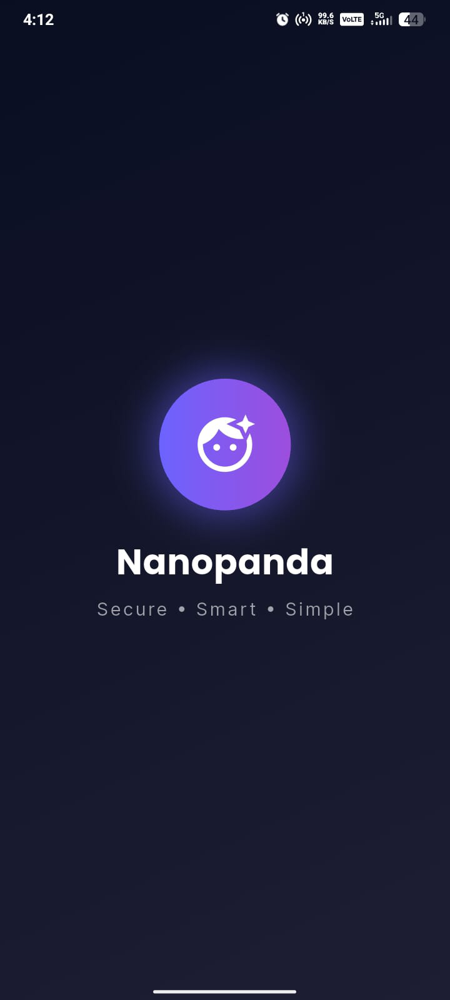

</div>

---

## 📱 Screenshots

<div align="center">

### 🔐 Face Authentication & Login
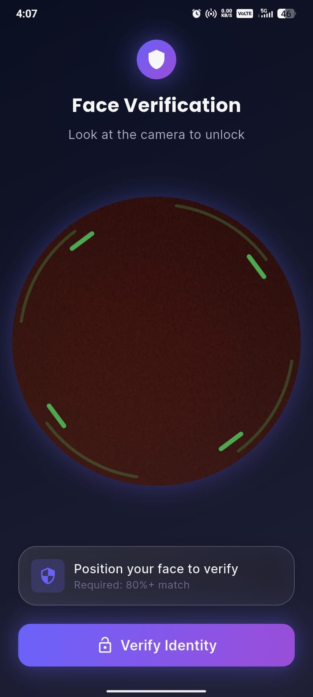 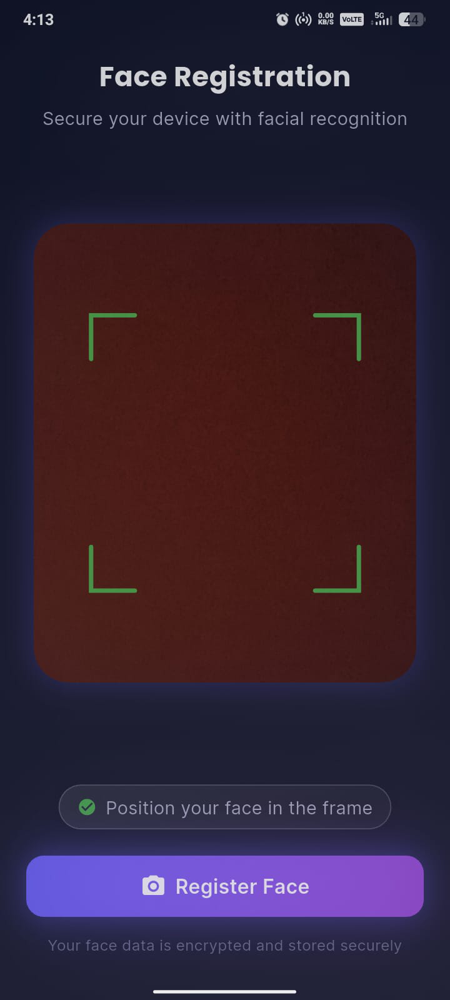 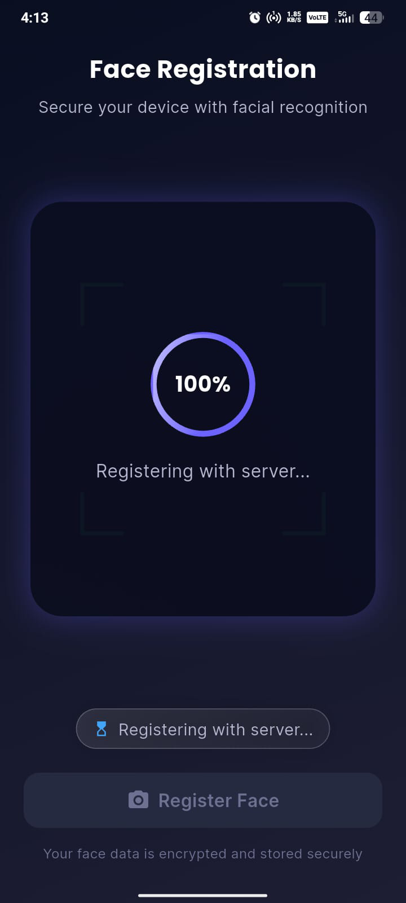

*Face verification with 80%+ match requirement • Secure registration flow • Real-time progress tracking*

---

### 🏠 Dashboard & Quick Stats
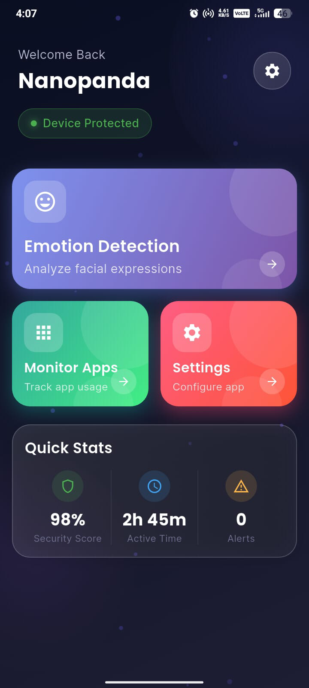

*Modern dashboard with Device Protection status • Security Score • Active Time tracking • Alert monitoring*

---

### 🎭 Emotion Detection
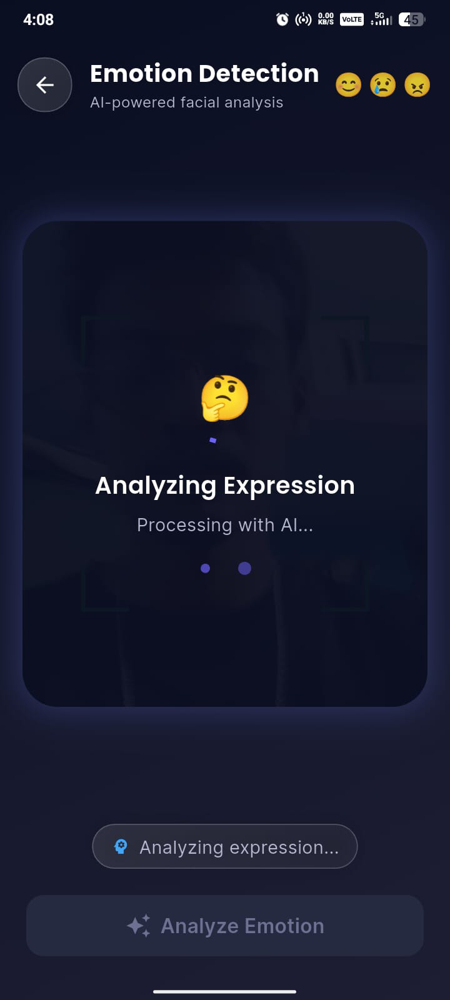 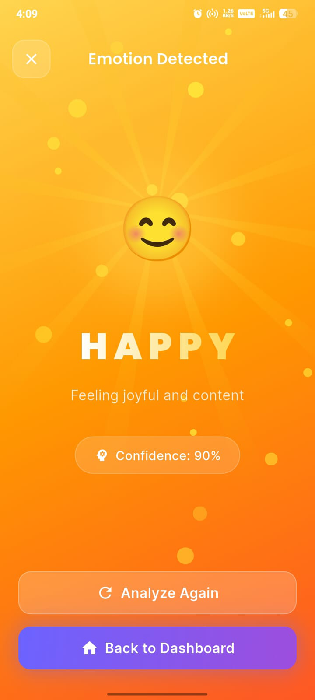 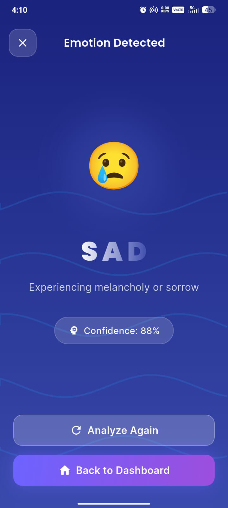 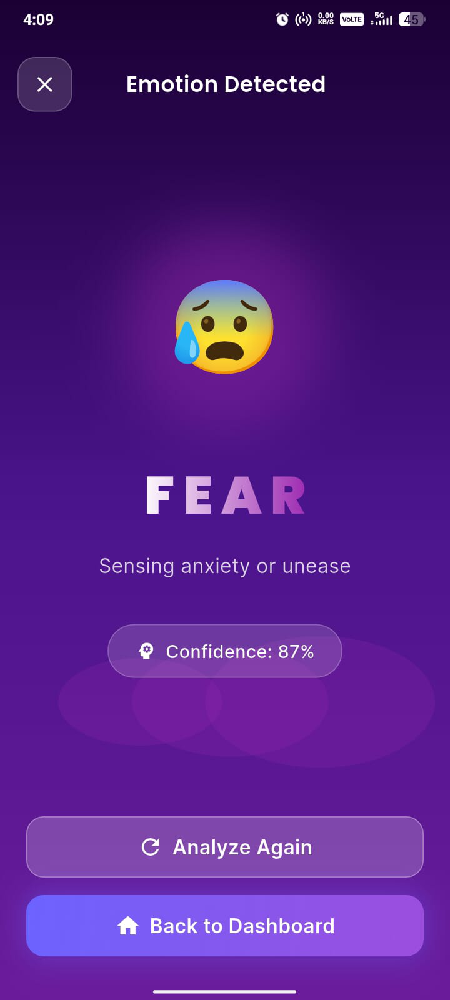 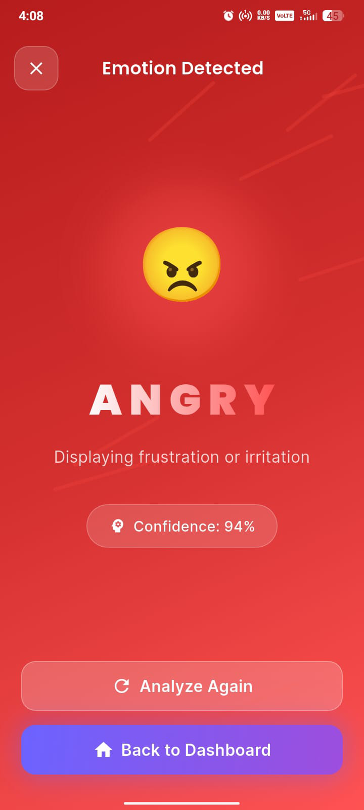 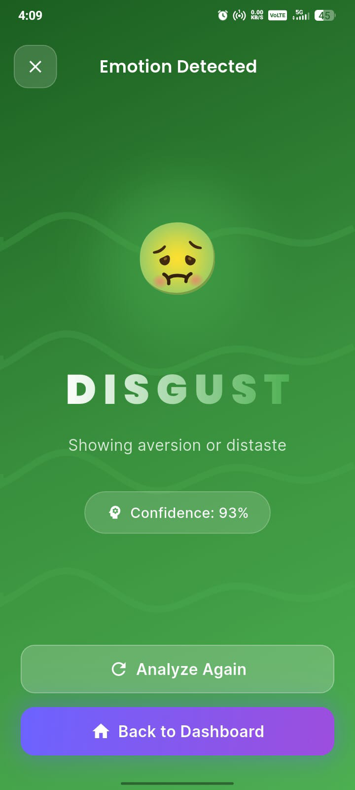 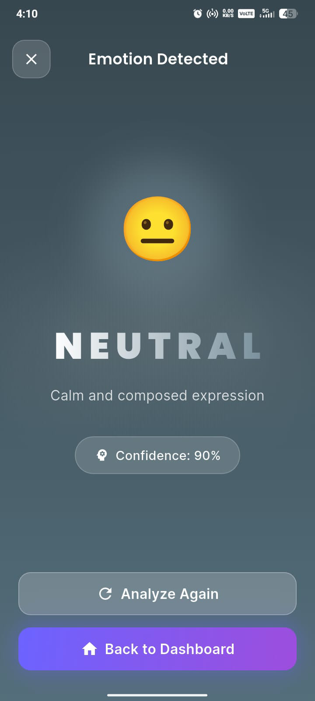

*AI-powered facial expression analysis • Real-time processing • 6 emotions with unique themed results*

---

### 📊 App Monitoring & Logs
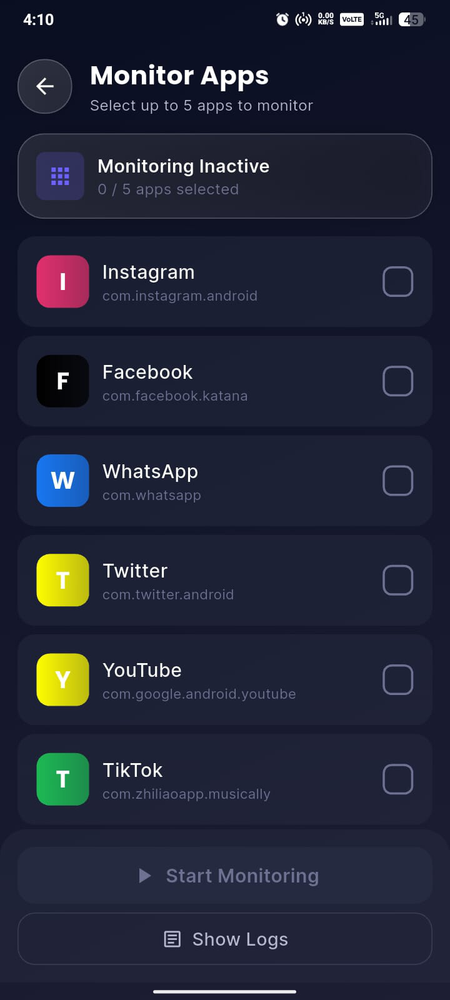 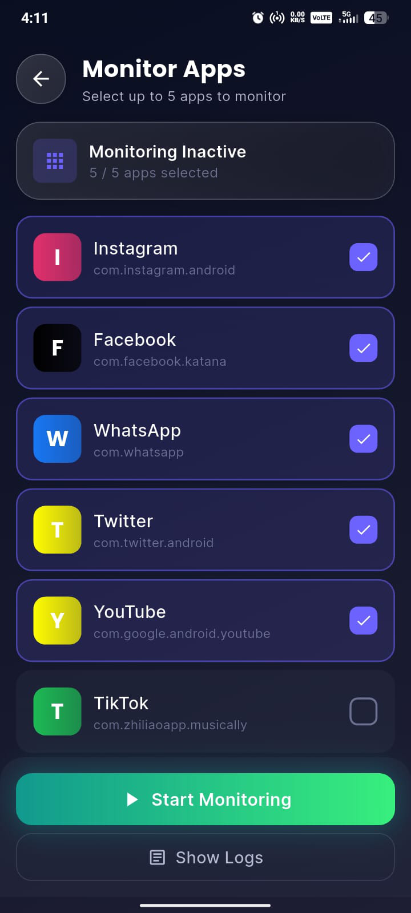 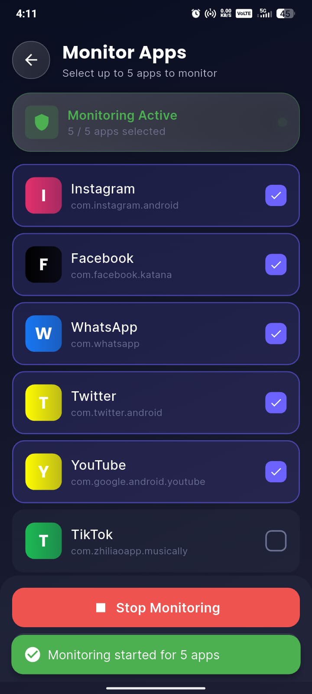

*Monitor up to 5 apps • Silent background verification • Comprehensive activity tracking*

---

### 📈 Activity Analytics
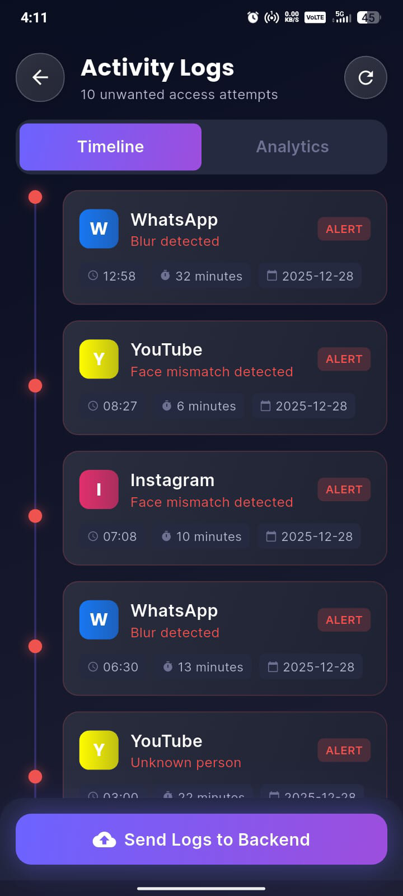 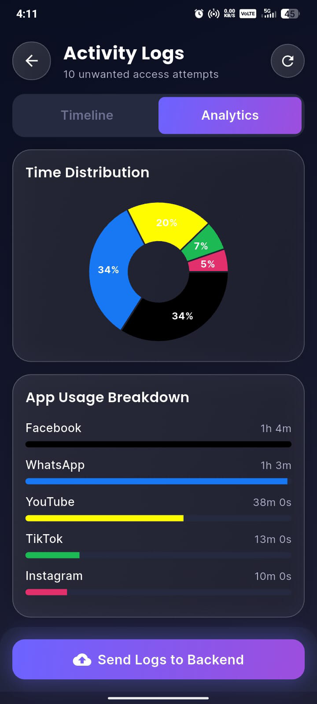

*Timeline view of access attempts • Visual analytics with charts • Session duration tracking*

---

### ⚙️ Settings & Configuration
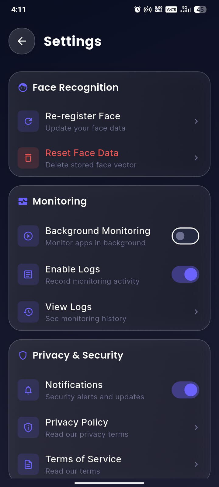 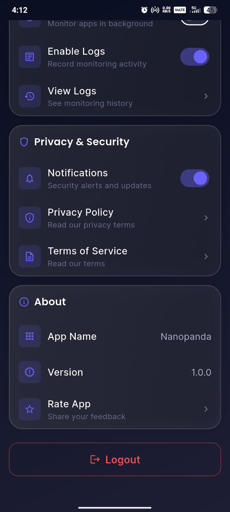 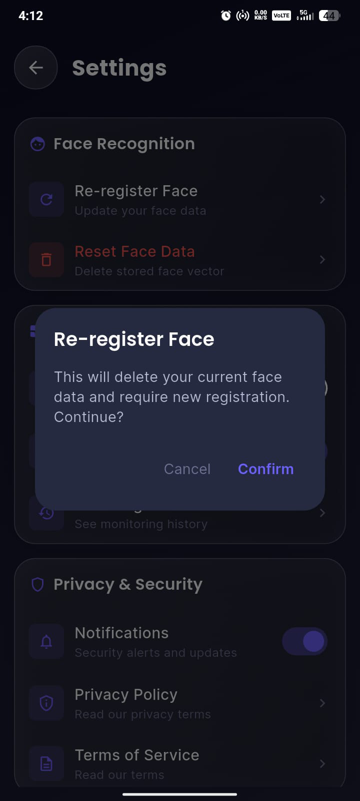 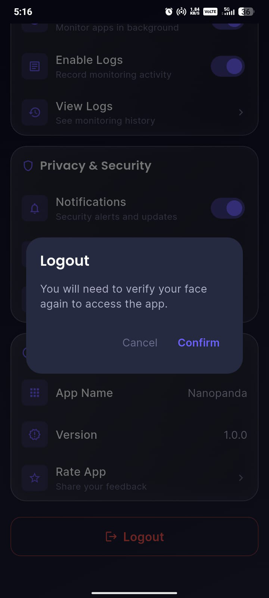 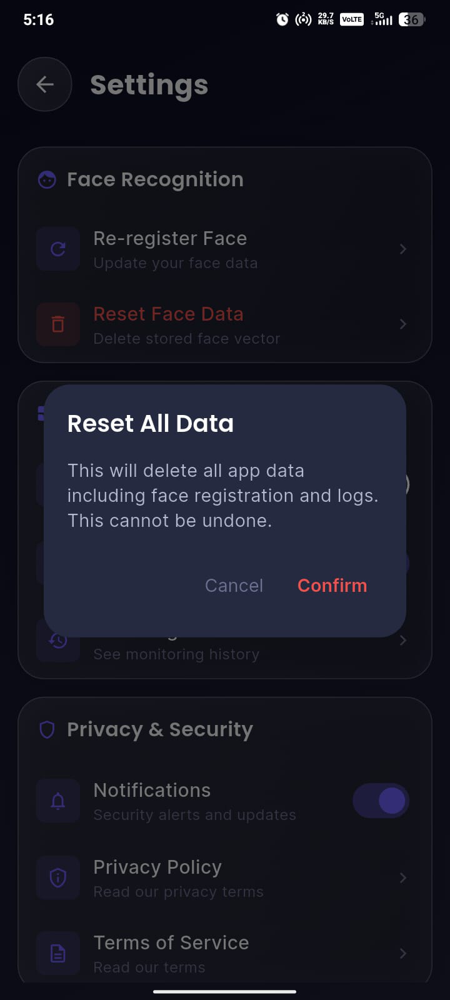

*Complete face data control • Monitoring preferences • Privacy settings • Secure logout • Data reset options*

</div>

---

## 🚀 Project Status

| Feature | Status | Description |
|---------|--------|-------------|
| 🎨 **Frontend (Flutter)** | ✅ **Complete** | Production-ready UI with modern design |
| 🔐 **Face Authentication** | ✅ **Complete** | On-device vector-based verification |
| 🎭 **Emotion Detection** | 🔄 **Integration Ready** | API placeholders prepared |
| 📱 **App Monitoring** | ✅ **Complete** | Background service with logging |
| 🌐 **Backend (Node.js)** | 🕒 **Planned** | API endpoints documented |
| 📊 **Analytics Dashboard** | ✅ **Complete** | Visual charts and timeline |

---

## ✨ Key Features

### 🔒 Advanced Face Authentication

- **🎯 Secure Registration**: Vector-based face embeddings with AES-256 encryption
- **⚡ Real-time Verification**: Live face matching with 80%+ accuracy threshold
- **🛡️ Anti-Spoofing Protection**: Advanced blur detection and face validation
- **🔄 Easy Re-registration**: Simple face data updates through settings
- **📱 Circular Scanning UI**: Intuitive interface with position guidance

### 🎭 Intelligent Emotion Detection

- **😊 6 Emotions Supported**: Happy, Sad, Angry, Fear, Neutral, Disgust
- **🤖 AI-Powered Analysis**: Real-time emotion recognition from camera
- **🎨 Beautiful Animations**: Unique emotion-specific full-screen experiences
- **📊 Confidence Scoring**: Percentage confidence for each detection
- **⚡ Instant Processing**: "Analyzing Expression" state with visual feedback

### 📱 Smart App Monitoring

- **📲 Multi-App Support**: Monitor up to 5 apps simultaneously
    - WhatsApp, Instagram, Facebook, YouTube, Twitter, TikTok
- **🔇 Silent Background Mode**: Discreet monitoring without user interruption
- **✅ Automatic Verification**: Face authentication when monitored apps open
- **🚨 Unauthorized Access Alerts**: Detects blur, face mismatch, or unknown persons
- **📊 Comprehensive Logging**: Detailed session tracking with timestamps

### 🏠 Intelligent Dashboard

- **🛡️ Device Protection Status**: Real-time security status indicator
- **📈 Security Score**: Current protection level (0-100%)
- **⏱️ Active Time Tracking**: Monitor total active monitoring duration
- **⚠️ Alerts Counter**: Unauthorized access attempts at a glance
- **🎯 Quick Access Cards**: Beautiful gradient cards for all features

### 📊 Detailed Activity Logging

- **📅 Timeline View**: Chronological display of all access attempts
- **📈 Visual Analytics**: Interactive pie charts and bar graphs
- **⏰ Session Tracking**: Entry time, exit time, and duration
- **🏷️ Alert Classification**: Color-coded indicators for different alert types
- **☁️ Backend Sync Ready**: One-tap upload with complete logs and metadata

### ⚙️ Privacy & Settings

- **👤 Face Management**: Re-register or completely reset face data
- **🔔 Monitoring Controls**: Toggle background monitoring and logging
- **🔒 Privacy Options**: Notifications, privacy policy, terms of service
- **ℹ️ App Information**: Version details and feedback options
- **🚪 Secure Logout**: Clear session and return to login screen

---

## 🎨 Design Highlights

### Modern UI/UX Philosophy

- **🌙 Dark Theme**: Eye-friendly navy color scheme with purple/blue accents
- **✨ Glassmorphism Effects**: Frosted glass aesthetic for modern look
- **🌈 Gradient Cards**: Beautiful color gradients (purple, teal, coral)
- **🔄 Smooth Animations**: Fluid transitions with loading states
- **🎯 Lucide Icons**: Consistent, professional visual language
- **📱 Responsive Design**: Adapts seamlessly to different screen sizes
- **⭕ Circular Progress**: Elegant scanning interface for face detection

### Emotion-Specific Themes

Each emotion features a unique visual experience:

| Emotion | Theme | Visual Elements |
|---------|-------|-----------------|
| 😊 **Happy** | Warm yellow/orange gradient | Floating circles, cheerful animations |
| 😢 **Sad** | Cool blue gradient | Gentle waves, calm motion |
| 😰 **Fear** | Deep purple gradient | Subtle dark animations |
| 😐 **Neutral** | Calm gray gradient | Minimal, balanced motion |
| 😠 **Angry** | Bold red gradient | Dynamic, intense animations |
| 🤢 **Disgust** | Green gradient | Aversion-themed visual effects |

### Dashboard Components

- **Welcome Section**: Personalized "Welcome Back" greeting
- **Status Badge**: Green "Device Protected" security indicator
- **Feature Cards**: Three gradient cards with icons
    - 😊 Emotion Detection (Purple) - Analyze expressions
    - 📱 Monitor Apps (Teal) - Track app usage
    - ⚙️ Settings (Coral) - Configure app
- **Quick Stats**: Three key metrics with icons
    - 🛡️ Security Score with percentage
    - 🕒 Active Time with duration
    - ⚠️ Alerts with count

---

## 🧠 App Flow Overview

### 1️⃣ First Launch: Face Registration
```
Launch App → Splash Screen → Face Registration Screen
→ Capture Face → Generate Embeddings → Encrypt & Store Locally
→ Prepare for Backend Upload → Navigate to Login
```

### 2️⃣ Face Login & Verification
```
Login Screen → Display Circular Scanning Interface
→ "Position your face to verify" → Capture Live Frame
→ Extract Face Vector → Compare with Stored Embeddings
→ ✅ 80-100% Match → Dashboard (Device Protected)
→ ❌ <80% Match / Blur / No Face → Retry Login
```

### 3️⃣ Main Dashboard
```
Dashboard → Display Welcome Message → Show Quick Stats
→ Three Feature Cards:
   • ⚙️ Settings
   • 🎭 Start Emotion Detection
   • 📱 Monitor Apps
```

### 4️⃣ Emotion Detection Flow
```
Emotion Detection → Open Camera → Show "Analyzing Expression"
→ Display Thinking Emoji (🤔) → "Processing with AI..."
→ Capture Frame → Send to Emotion API → Receive Result
→ Display Full-Screen Emotion UI → Analyze Again or Back
```

### 5️⃣ App Monitoring Flow
```
Monitor Apps → Select Up to 5 Apps → Start Monitoring
→ Background Service Activates
→ Monitored App Opened → Capture Face Silently
→ ✅ Face Match → Allow Access (No Log)
→ ❌ Unauthorized → Log Event (App, Time, Duration, Reason)
→ Update Alerts Counter on Dashboard
```

### 6️⃣ Activity Logs & Analytics
```
View Logs → Timeline Tab:
  • All unauthorized access attempts
  • App name, timestamps, duration, alert type

Analytics Tab:
  • Time distribution pie chart
  • App usage breakdown
  • Total access attempts

Send to Backend:
  • Upload all logs with one tap
  • Include face vectors and metadata
```

---

## 🗂️ Project Architecture

```
lib/
├── core/                          # Shared utilities and constants
│   ├── constants/
│   │   ├── app_colors.dart
│   │   ├── app_strings.dart
│   │   └── app_routes.dart
│   ├── theme/
│   │   └── app_theme.dart
│   └── utils/
│       ├── validators.dart
│       └── helpers.dart
│
├── models/                        # Data models
│   ├── face_vector_model.dart
│   ├── emotion_model.dart
│   ├── log_entry_model.dart
│   └── app_info_model.dart
│
├── services/                      # Core services
│   ├── camera_service.dart
│   ├── storage_service.dart
│   └── encryption_service.dart
│
├── features/
│   ├── face_auth/                # Face authentication module
│   │   ├── screens/
│   │   │   ├── face_registration_page.dart
│   │   │   └── face_login_page.dart
│   │   ├── widgets/
│   │   │   ├── camera_overlay.dart
│   │   │   ├── face_frame_widget.dart
│   │   │   └── circular_scanner.dart
│   │   └── repositories/
│   │       └── face_auth_repository.dart
│   │
│   ├── emotion_detection/        # Emotion detection module
│   │   ├── screens/
│   │   │   ├── emotion_detection_page.dart
│   │   │   └── emotion_result_page.dart
│   │   ├── widgets/
│   │   │   ├── scanning_animation.dart
│   │   │   ├── emotion_background.dart
│   │   │   └── analyzing_indicator.dart
│   │   └── repositories/
│   │       └── emotion_repository.dart
│   │
│   ├── app_monitoring/           # App monitoring module
│   │   ├── screens/
│   │   │   ├── app_selection_page.dart
│   │   │   └── logs_page.dart
│   │   ├── widgets/
│   │   │   ├── app_card.dart
│   │   │   ├── log_timeline.dart
│   │   │   └── analytics_chart.dart
│   │   ├── services/
│   │   │   └── background_monitor_service.dart
│   │   └── repositories/
│   │       ├── app_monitor_repository.dart
│   │       └── log_repository.dart
│   │
│   └── settings/                 # Settings module
│       ├── screens/
│       │   └── settings_page.dart
│       └── widgets/
│           └── settings_card.dart
│
├── ui/                           # Shared UI components
│   ├── dashboard/
│   │   ├── dashboard_page.dart
│   │   ├── dashboard_card.dart
│   │   └── quick_stats_widget.dart
│   ├── widgets/
│   │   ├── animated_background.dart
│   │   ├── custom_button.dart
│   │   ├── loading_indicator.dart
│   │   └── status_badge.dart
│   └── splash/
│       └── splash_screen.dart
│
├── providers/                    # State management
│   ├── app_state_provider.dart
│   └── stats_provider.dart
│
└── main.dart                     # App entry point
```

---

## 🛠️ Tech Stack

| Category | Technology |
|----------|-----------|
| **Framework** | Flutter 3.0+ |
| **Language** | Dart 3.0+ |
| **State Management** | Provider |
| **Local Storage** | Shared Preferences, Hive |
| **Encryption** | AES-256 |
| **Camera** | Camera Plugin |
| **Charts** | FL Chart |
| **Icons** | Lucide Icons |
| **Animations** | Flutter Animate, Lottie |
| **Backend (Planned)** | Node.js + Express |
| **Database (Planned)** | PostgreSQL / MongoDB |

---

## 📦 Dependencies

```yaml
dependencies:
  flutter:
    sdk: flutter

  # State Management
  provider: ^6.0.5

  # Local Storage
  shared_preferences: ^2.2.0
  hive: ^2.2.3
  hive_flutter: ^1.1.0

  # Camera & Image Processing
  camera: ^0.10.5
  image_picker: ^1.0.0
  image: ^4.0.17

  # Encryption & Security
  encrypt: ^5.0.1
  crypto: ^3.0.3

  # UI & Animations
  flutter_animate: ^4.2.0
  shimmer: ^3.0.0
  lottie: ^2.6.0

  # Charts & Data Visualization
  fl_chart: ^0.63.0

  # Icons
  lucide_icons: ^0.263.0

  # HTTP & API Calls
  http: ^1.1.0
  dio: ^5.3.2

  # Platform Services
  flutter_background_service: ^5.0.0
  app_usage: ^2.1.0

  # Utilities
  intl: ^0.18.1
  uuid: ^4.0.0
```

---

## ▶️ Getting Started

### Prerequisites

- ✅ Flutter SDK 3.0 or higher
- ✅ Dart 3.0 or higher
- ✅ Android Studio / VS Code with Flutter plugins
- ✅ Physical device or emulator with camera support

### Installation

1. **Clone the repository**
   ```bash
   git clone https://github.com/srihari2479/Nanopanda.git
   cd Nanopanda
   ```

2. **Install dependencies**
   ```bash
   flutter pub get
   ```

3. **Run code generation** (if using freezed/json_serializable)
   ```bash
   flutter pub run build_runner build --delete-conflicting-outputs
   ```

4. **Run the app**
   ```bash
   flutter run
   ```

### Android Permissions

Add these to `android/app/src/main/AndroidManifest.xml`:

```xml
<uses-permission android:name="android.permission.CAMERA" />
<uses-permission android:name="android.permission.INTERNET" />
<uses-permission android:name="android.permission.PACKAGE_USAGE_STATS" />
<uses-permission android:name="android.permission.FOREGROUND_SERVICE" />
<uses-permission android:name="android.permission.WAKE_LOCK" />
```

### iOS Permissions

Add these to `ios/Runner/Info.plist`:

```xml
<key>NSCameraUsageDescription</key>
<string>This app needs camera access for face authentication and emotion detection</string>
<key>NSPhotoLibraryUsageDescription</key>
<string>This app needs photo library access to save captured images</string>
```

---

## 🔌 Backend & API Integration

### Face Authentication API

**Endpoint:** `POST /api/face/register`

**Request:**
```json
{
  "userId": "user_123",
  "faceVector": [0.123, 0.456, "..."],
  "timestamp": "2025-12-28T04:13:00Z"
}
```

**Response:**
```json
{
  "success": true,
  "message": "Face registered successfully",
  "userId": "user_123"
}
```

### Emotion Detection API

**Endpoint:** `POST /api/emotion/detect`

**Request:**
```json
{
  "imageBase64": "data:image/jpeg;base64,/9j/4AAQ...",
  "timestamp": "2025-12-28T04:13:00Z"
}
```

**Response:**
```json
{
  "emotion": "happy",
  "confidence": 0.90,
  "alternatives": [
    {"emotion": "neutral", "confidence": 0.08},
    {"emotion": "surprise", "confidence": 0.02}
  ]
}
```

### Activity Logs Sync API

**Endpoint:** `POST /api/logs/sync`

**Request:**
```json
{
  "userId": "user_123",
  "logs": [
    {
      "appName": "WhatsApp",
      "packageName": "com.whatsapp",
      "entryTime": "2025-12-28T12:58:00Z",
      "exitTime": "2025-12-28T13:30:00Z",
      "duration": 1920,
      "alertType": "blur_detected",
      "faceVector": [0.123, 0.456, "..."]
    }
  ]
}
```

**Response:**
```json
{
  "success": true,
  "logsSynced": 10,
  "message": "Logs uploaded successfully"
}
```

### Repository Implementation Example

```dart
class FaceAuthRepository {
  final String baseUrl = 'https://api.yourbackend.com';

  Future<bool> registerFace(FaceVectorModel faceData) async {
    try {
      final response = await http.post(
        Uri.parse('$baseUrl/api/face/register'),
        headers: {'Content-Type': 'application/json'},
        body: jsonEncode(faceData.toJson()),
      );

      if (response.statusCode == 200) {
        final data = jsonDecode(response.body);
        return data['success'] ?? false;
      }
      return false;
    } catch (e) {
      print('Error registering face: $e');
      return false;
    }
  }
}
```

---

## 🎯 Key Features Implementation

### Face Vector Comparison Algorithm

```dart
double compareFaceVectors(List<double> vector1, List<double> vector2) {
  if (vector1.length != vector2.length) return 0.0;

  // Calculate Euclidean distance
  double sum = 0;
  for (int i = 0; i < vector1.length; i++) {
    sum += pow(vector1[i] - vector2[i], 2);
  }
  double distance = sqrt(sum);

  // Convert to similarity percentage (0-100%)
  double maxDistance = sqrt(vector1.length);
  double similarity = (1 - (distance / maxDistance)) * 100;

  return similarity.clamp(0.0, 100.0);
}
```

### Validation Rules

```dart
class FaceAuthValidator {
  static const double SIMILARITY_THRESHOLD = 80.0;

  static AuthResult validate({
    required double similarity,
    required bool isFaceDetected,
    required bool isBlurred,
  }) {
    if (!isFaceDetected) {
      return AuthResult.noFaceDetected;
    }

    if (isBlurred) {
      return AuthResult.blurDetected;
    }
    
    if (similarity >= SIMILARITY_THRESHOLD) {
      return AuthResult.authorized;
    }
    
    return AuthResult.unauthorized;
  }
}

enum AuthResult {
  authorized,
  unauthorized,
  noFaceDetected,
  blurDetected,
}
```

### Circular Scanner Widget

```dart
class CircularScanner extends StatefulWidget {
  final double progress; // 0.0 to 1.0
  final Color activeColor;
  final Color inactiveColor;

  const CircularScanner({
    Key? key,
    required this.progress,
    this.activeColor = Colors.green,
    this.inactiveColor = Colors.brown,
  }) : super(key: key);

  @override
  State<CircularScanner> createState() => _CircularScannerState();
}

class _CircularScannerState extends State<CircularScanner>
    with SingleTickerProviderStateMixin {
  late AnimationController _controller;

  @override
  void initState() {
    super.initState();
    _controller = AnimationController(
      vsync: this,
      duration: const Duration(seconds: 2),
    )..repeat();
  }

  @override
  Widget build(BuildContext context) {
    return CustomPaint(
      size: Size(300, 300),
      painter: CircularScannerPainter(
        progress: widget.progress,
        activeColor: widget.activeColor,
        inactiveColor: widget.inactiveColor,
        animationValue: _controller.value,
      ),
    );
  }

  @override
  void dispose() {
    _controller.dispose();
    super.dispose();
  }
}
```

---

## 🔒 Privacy & Security Notes

### Data Security

- **🔐 Local Encryption**: All face vectors stored using AES-256 encryption
- **💾 Secure Storage**: Uses Flutter Secure Storage for sensitive data
- **🚫 No Raw Images**: Only vector embeddings are stored, never raw images
- **⏱️ Temporary Cache**: Camera frames immediately discarded after processing

### Privacy Compliance

- **✅ Explicit Consent**: Users must agree to face data collection
- **📊 Data Minimization**: Only necessary data is collected
- **🗑️ Right to Delete**: Users can reset all face data anytime
- **📜 Transparency**: Clear privacy policy and terms of service
- **📱 Local First**: All processing happens on-device by default

### Best Practices for Production

- ✅ Always use HTTPS for API calls
- ✅ Implement certificate pinning
- ✅ Add biometric authentication as secondary factor
- ✅ Regular security audits
- ✅ Comply with GDPR, CCPA, and local privacy laws
- ✅ Provide clear data retention policies
- ✅ Implement secure key management
- ✅ Add tamper detection mechanisms

---

## 🧪 Testing

### Unit Tests
```bash
flutter test
```

### Widget Tests
```bash
flutter test test/widget_test.dart
```

### Integration Tests
```bash
flutter drive --target=test_driver/app.dart
```

---

## 👥 Team

### Core Contributors

<table>
  <tr>
    <td align="center">
      <br />
      <sub><b>Choppa Srihari</b></sub><br />
      <sub>Frontend & API Integration</sub><br />
      <a href="mailto:sriharichoppa12@gmail.com">📧 sriharichoppa12@gmail.com</a><br />
      <a href="tel:+919948370693">📱 +91 9948370693</a>
    </td>
    <td align="center">
      <br />
      <sub><b>Amudala Omkar</b></sub><br />
      <sub>Backend & API Integration</sub><br />
      <a href="mailto:omkar@gmail.com">📧 omkar@gmail.com</a><br />
      <a href="tel:+917989453557">📱 +91 7989453557</a>
    </td>
    <td align="center">
      <br />
      <sub><b>Gorajana Bindhu Madhav</b></sub><br />
      <sub>Database & Maintenance</sub><br />
      <a href="mailto:bindhumadhav2006@gmail.com">📧 bindhumadhav2006@gmail.com</a><br />
      <a href="tel:+917993986900">📱 +91 7993986900</a>
    </td>
  </tr>
</table>

---

## 🤝 Contributing

Contributions are welcome! Please follow these steps:

1. Fork the repository
2. Create a feature branch: `git checkout -b feature/amazing-feature`
3. Commit your changes: `git commit -m "Add amazing feature"`
4. Push to the branch: `git push origin feature/amazing-feature`
5. Open a Pull Request

### Code Style Guidelines

- Follow [Effective Dart](https://dart.dev/guides/language/effective-dart) guidelines
- Use meaningful variable and function names
- Add comments for complex logic
- Write unit tests for new features
- Ensure all tests pass before submitting PR

---

## 📄 License

This project is licensed under the **MIT License** — see the [LICENSE](LICENSE) file for details.

```
MIT License

Copyright (c) 2025 Nano Panda Development Team

Permission is hereby granted, free of charge, to any person obtaining a copy
of this software and associated documentation files (the "Software"), to deal
in the Software without restriction, including without limitation the rights
to use, copy, modify, merge, publish, distribute, sublicense, and/or sell
copies of the Software, and to permit persons to whom the Software is
furnished to do so, subject to the following conditions:

The above copyright notice and this permission notice shall be included in all
copies or substantial portions of the Software.

THE SOFTWARE IS PROVIDED "AS IS", WITHOUT WARRANTY OF ANY KIND, EXPRESS OR
IMPLIED, INCLUDING BUT NOT LIMITED TO THE WARRANTIES OF MERCHANTABILITY,
FITNESS FOR A PARTICULAR PURPOSE AND NONINFRINGEMENT. IN NO EVENT SHALL THE
AUTHORS OR COPYRIGHT HOLDERS BE LIABLE FOR ANY CLAIM, DAMAGES OR OTHER
LIABILITY, WHETHER IN AN ACTION OF CONTRACT, TORT OR OTHERWISE, ARISING FROM,
OUT OF OR IN CONNECTION WITH THE SOFTWARE OR THE USE OR OTHER DEALINGS IN THE
SOFTWARE.
```

---

## 💡 Future Enhancements

### Planned Features

| Feature | Description | Priority |
|---------|-------------|----------|
| 👁️ **Liveness Detection** | Blink or head movement verification | High |
| 👥 **Multi-face Support** | Register multiple authorized users | High |
| ☁️ **Cloud Sync** | Real-time backup and multi-device support | Medium |
| 📊 **Advanced Analytics** | ML-powered usage insights | Medium |
| 👨‍👩‍👧‍👦 **Parental Controls** | Enhanced monitoring for family safety | High |
| 🎤 **Voice Commands** | Hands-free operation | Low |
| 📴 **Offline Mode** | Full functionality without internet | Medium |
| 📄 **Export Reports** | PDF/CSV generation for logs | Medium |
| 🌍 **Geofencing** | Location-based security rules | Low |
| ⏰ **Time-based Access** | Schedule allowed usage times | Medium |
| 👆 **Biometric Backup** | Fingerprint as secondary authentication | High |

### Integration Ideas

- 🏢 Enterprise MDM systems
- 🏠 Smart home automation
- ⌚ Wearable device sync
- 🔐 Third-party security platforms
- 👨‍👩‍👧 Parental control services

---

## 📞 Support & Contact

- **Issues**: [GitHub Issues](https://github.com/srihari2479/Nanopanda/issues)
- **Discussions**: [GitHub Discussions](https://github.com/srihari2479/Nanopanda/discussions)
- **Email**: sriharichoppa12@gmail.com
- **Phone**: +91 9948370693

---

## 🚀 Quick Setup

### Create a new repository on the command line
```bash
echo "# Nanopanda" >> README.md
git init
git add README.md
git commit -m "first commit"
git branch -M main
git remote add origin https://github.com/srihari2479/Nanopanda.git
git push -u origin main
```

### Push an existing repository from the command line
```bash
git remote add origin https://github.com/srihari2479/Nanopanda.git
git branch -M main
git push -u origin main
```

### Import repository from another source
```bash
git clone <your-existing-repo-url>
cd <your-repo-directory>
git remote set-url origin https://github.com/srihari2479/Nanopanda.git
git push -u origin main
```

---

## 🌟 Acknowledgments

- 💙 Flutter team for the amazing framework
- 🌐 Open source community for inspiration
- 🧪 Contributors and testers
- 🎨 Icon designers and UI/UX inspirations
- 🧠 Face recognition and emotion detection research community

---

## 📊 Project Stats


---

<div align="center">

### Made with ❤️ using Flutter

**Nano Panda** — Your AI-powered security companion

⭐ Star this repo if you found it helpful!

<br/>

*Developed by Team Nano Panda*

<sub>Choppa Srihari • Amudala Omkar • Gorajana Bindhu Madhav</sub>
